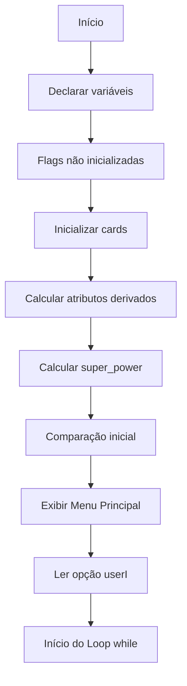
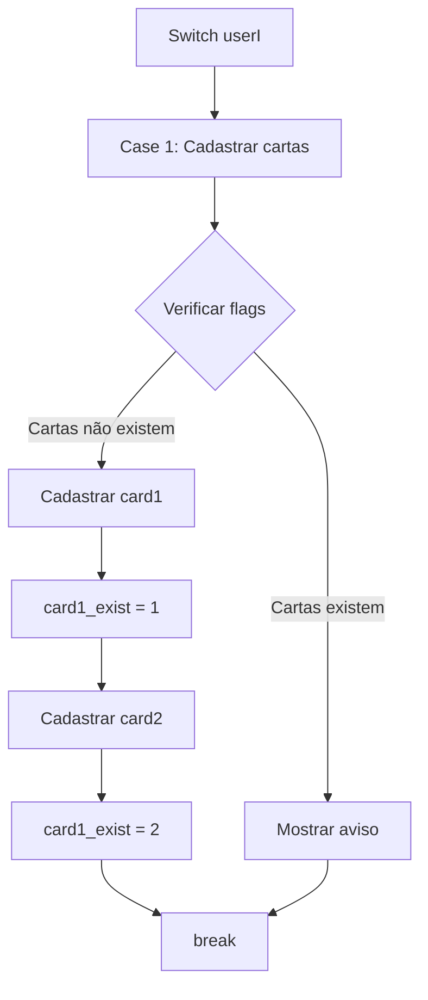
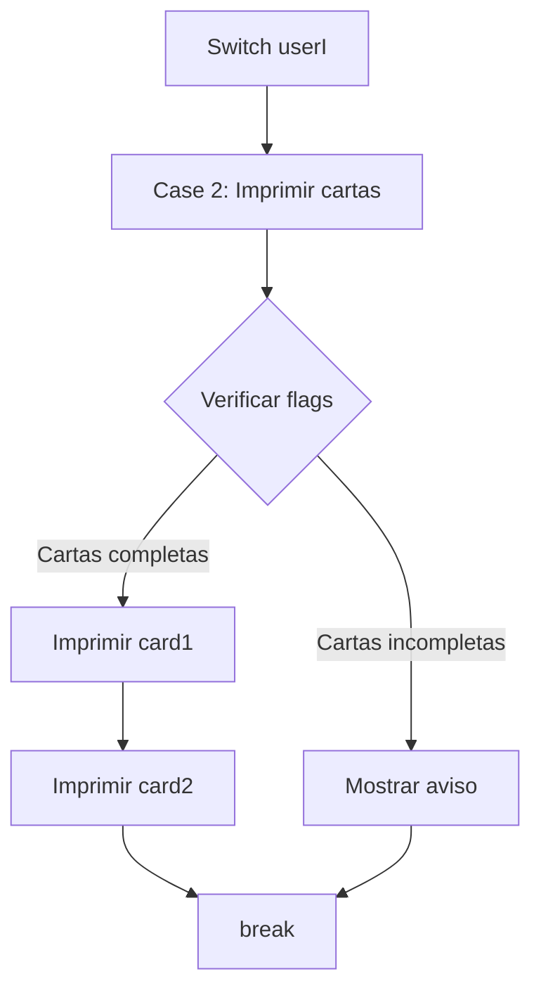
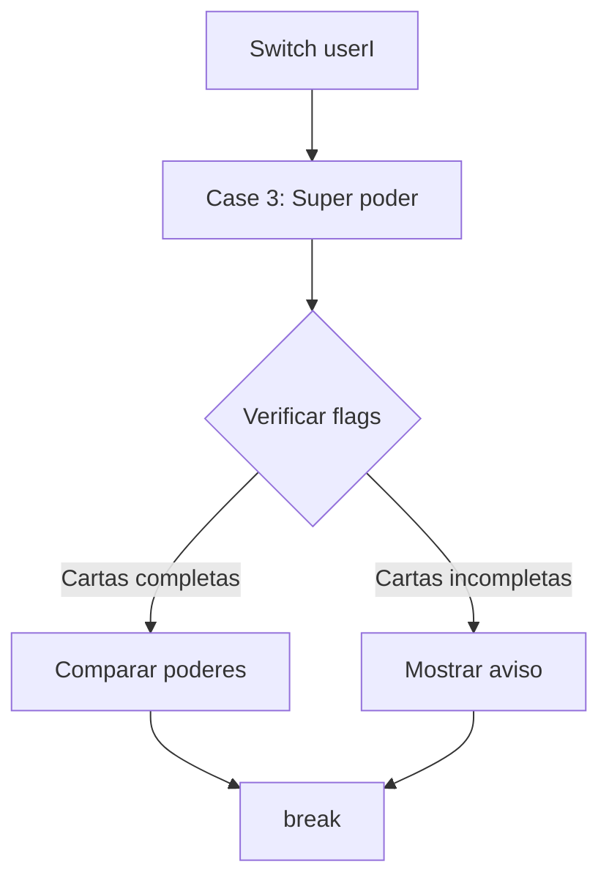
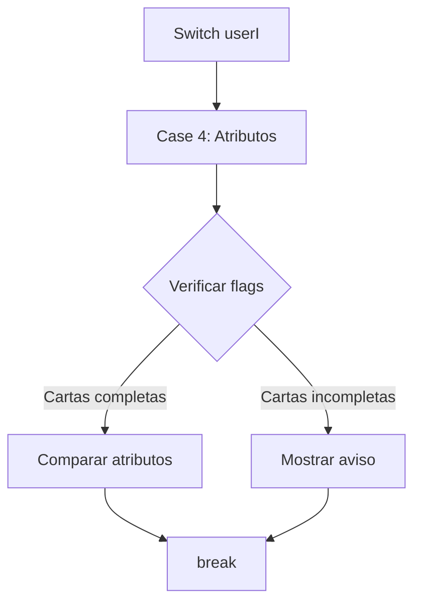
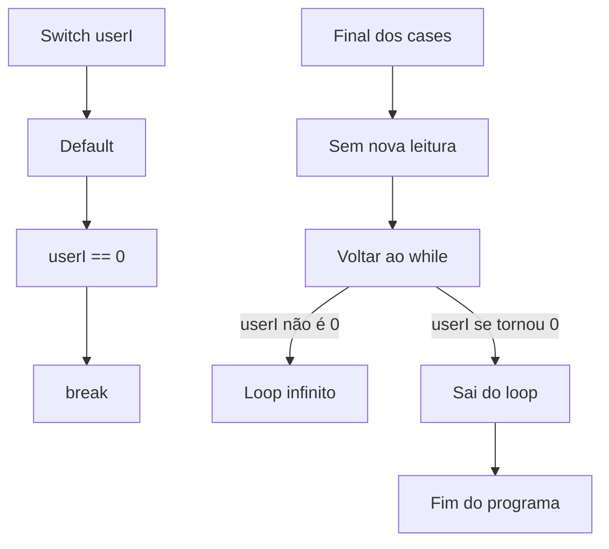

# Fluxograma do Super Trunfo (Em Partes)

Este documento apresenta o fluxograma do programa `CartasSuperTrunfo.c` dividido em seções menores para facilitar a visualização e compreensão.

## Parte 1: Inicialização do Programa

## Parte 2: Case 1 - Cadastrar Cartas

## Parte 3: Case 2 - Imprimir Cartas

## Parte 4: Case 3 - Comparar Super Poder

## Parte 5: Case 4 - Comparar Atributos

## Parte 6: Default e Final do Loop

## Problemas Identificados no Código

1. **Inicialização de Variáveis**
   - `card1_exist` e `card2_exist` são declaradas mas não inicializadas com 0, o que pode levar a comportamento indefinido nas primeiras verificações.

2. **Atribuição Incorreta**
   - Após cadastrar `card2`, o código atribui `card1_exist = 2;` em vez de `card2_exist = 1;` (ou 2).

3. **Loop Infinito Potencial**
   - `userI` é lido apenas uma vez, antes do loop `while (userI != 0)`. Como não há leitura de `userI` dentro do loop, o programa pode entrar em um loop infinito.

4. **Comparação vs. Atribuição no Default**
   - O código usa `userI == 0;` (comparação) no default, em vez de `userI = 0;` (atribuição), o que não altera o valor de `userI`.

5. **Comparação de Cartas Antes do Menu**
   - `imprima_comparação_cartas(&card1, &card2);` é chamada antes do menu principal, forçando o usuário a comparar cartas antes mesmo de ver o menu.

6. **Design de Menu Inadequado**
   - Para um menu interativo funcional, o `printf` do menu e o `scanf` para atualizar `userI` deveriam estar dentro do loop `while`.
